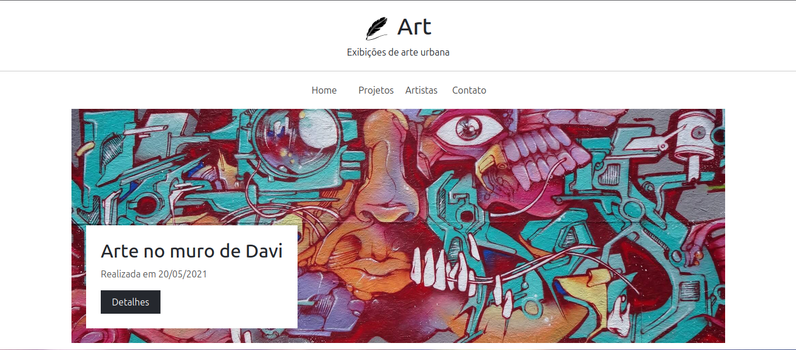
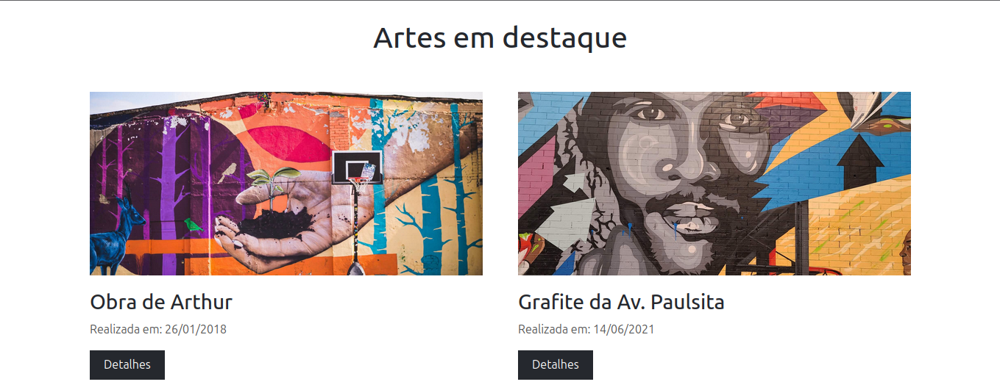
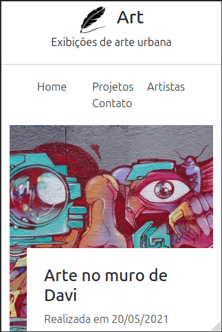
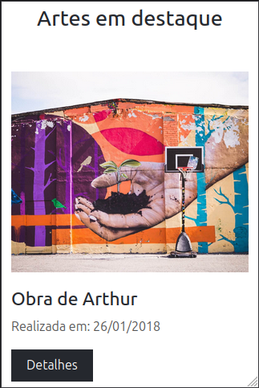

# Art Project - Urban Art Exhibitions

A responsive landing page dedicated to showcasing urban art exhibitions, featuring highlighted artworks and social media integration. This project demonstrates the use of Bootstrap 5 for creating modern, mobile-friendly web layouts.

## Technologies Used

- **HTML5**: Structure of the webpage.
- **CSS3**: Custom styling (`assets/css/styles.css`).
- **Bootstrap 5 (v5.0.1)**: Framework used for responsive layout, grid system, and components.
- **Bootstrap Icons (v1.5.0)**: Library for the icons used in the social media section.

## Project Structure

```bash
.
├── .github
│   ├── preview-desktop-01.png
│   ├── preview-desktop-02.png
│   ├── preview-mobile-01.png
│   └── preview-mobile-02.png
├── assets
│   ├── css
│   │   └── styles.css
│   └── img
│       ├── art_logo.svg
│       ├── favicon.ico
│       ├── g_1.jpg
│       ├── g_2.jpg
│       ├── g_3.jpg
│       ├── g_4.jpg
│       ├── g_5.jpg
│       └── g_6.jpg
├── index.html
└── README.md
```

## How to Run

Since this is a static website, you don't need to install any heavy dependencies.

1.  **Clone the repository**:
    ```bash
    git clone https://github.com/alexandrerogeriosn93/project-bootstrap-art.git
    ```
2.  **Open the project**:

    - Navigate to the project folder.
    - Double-click `index.html` to open it in your default web browser.

    **Optional (Recommended)**: For a better development experience, you can serve the files using a local HTTP server:

    - **VS Code**: Right-click `index.html` and select "Open with Live Server" (requires the Live Server extension).
    - **Python**: Run `python3 -m http.server` in the terminal within the project directory.
    - **Node.js**: Run `npx http-server` in the terminal.

## Project Screenshots








